<div align="center">


<br>

<p>


</p>

<p>

</p>

<p>
<a href="https://kaif-hosen.netlify.app"></a>
<a href="https://www.linkedin.com/in/mohammad-kaif-hosen-topader-ab448a395/"></a>
<a href="mailto:mohammadkaif261001@gmail.com"></a>
<a href="https://judge.beecrowd.com/en/profile/1207444"></a>
</p>

</div>

<br>

<table width="100%">
<tr>
<td width="60%" valign="top">

## 💫 About Me

I'm a **CSE student from Bangladesh** building toward a career as a software developer — one deliberate, well-tested commit at a time.

Right now my focus is **Java, Object-Oriented Programming, and Web Development**, layered on top of daily DSA practice. I care more about *why* code works than just making it run, which is why I lean on clean structure and file-driven logic even in small practice projects.

**What I'm optimizing for in 2026:**
- 🧠 Deep, not surface-level, Java + DSA fundamentals
- 🏗️ Fewer, better-documented projects over many shallow ones
- 🤝 My first real open-source contribution

<br>

```text
const developer = {
  name: "MD. Kaif Hosen Topader",
  location: "Bangladesh 🇧🇩",
  role: "CSE Student",
  stack: ["Java", "C", "C++", "JavaScript", "HTML/CSS"],
  learning: ["DSA", "SQL", "Spring Boot", "React"],
  currentGoal: "Software Engineering Internship"
};
```

</td>
<td width="40%" valign="top" align="center">


<br>

> *"Success doesn't come from what you do occasionally.*
> *It comes from what you do consistently."*

</td>
</tr>
</table>

---

## 🧭 Learning Roadmap

```mermaid
graph LR
    A[Programming Fundamentals] --> B[C / C++]
    B --> C[Java & OOP]
    C --> D[Data Structures & Algorithms]
    D --> E[SQL]
    E --> F[Spring Boot]
    F --> G[React]
    G --> H[Full-Stack Development]

    style A fill:#0F2027,stroke:#00B4DB,color:#fff
    style B fill:#203A43,stroke:#00B4DB,color:#fff
    style C fill:#2C5364,stroke:#00B4DB,color:#fff
    style D fill:#2C5364,stroke:#00B4DB,color:#fff
    style E fill:#203A43,stroke:#00B4DB,color:#fff
    style F fill:#0F2027,stroke:#00B4DB,color:#fff
    style G fill:#0F2027,stroke:#00B4DB,color:#fff
    style H fill:#00B4DB,stroke:#fff,color:#000
```

<div align="center">



</div>

<sub>💡 Mermaid diagrams render natively on GitHub — no extra setup needed.</sub>

---

## 🛠 Tech Stack & Proficiency

<table width="100%">
<tr><td>

**Core Languages**

`Java` ████████░░ 80%
`C++` ██████░░░░ 60%
`C` ███████░░░ 70%
`JavaScript` █████░░░░░ 50%

</td><td>

**Web & Currently Learning**

`HTML/CSS` ████████░░ 80%
`SQL` ███░░░░░░░ 30%
`React` ██░░░░░░░░ 20%
`Spring Boot` ██░░░░░░░░ 20%

</td></tr>
</table>

<div align="center">


</div>

---

## 💼 Featured Projects

<table width="100%">
<tr>
<td width="50%" valign="top">

### 🛡️ Smart Entry Security System
Java-based access control simulator with OTP verification, Face ID simulation, entry logging, time validation, and automatic fine calculation.

  

</td>
<td width="50%" valign="top">

### 🌐 Personal Portfolio Website
Fully responsive personal portfolio built to showcase projects, skills, and learning progress with a modern UI.

  

<a href="https://kaif-hosen.netlify.app"></a>

</td>
</tr>
<tr>
<td width="50%" valign="top">

### 📚 Java Practice Repository
Ongoing collection of Java programs covering core syntax, OOP, exception handling, and file-handling exercises.


</td>
<td width="50%" valign="top">

### 💻 HTML & CSS Projects
Growing set of responsive web pages built while learning modern layout techniques (Flexbox, Grid).

 

</td>
</tr>
</table>

<div align="center">
<sub>🚧 Building in public — quality over quantity. Repo links go live as each project ships.</sub>
</div>

---

## 🐍 Contribution Snake

<div align="center">


<sub>Enable this with the workflow at the bottom of this README (one-time setup).</sub>

</div>

---

## 📊 GitHub Analytics

<div align="center">


<br>


<br>


</div>

---

## 📍 Location

<div align="center">


<br><sub>📍 Based in Dhaka, Bangladesh — open to remote opportunities</sub>

</div>

---

## 🎯 2026 Milestones

<table width="100%">
<tr>
<td width="50%" valign="top">

**Skill Building**
- [x] Strengthen programming fundamentals
- [ ] Master Java programming
- [ ] Complete DSA roadmap
- [ ] Learn SQL
- [ ] Learn Spring Boot
- [ ] Learn React

</td>
<td width="50%" valign="top">

**Output & Growth**
- [ ] Build 20+ real-world projects
- [ ] Solve 1,000+ programming problems
- [ ] Make first open-source PR
- [ ] Land a software engineering internship
- [ ] Write technical notes/blog as I learn

</td>
</tr>
</table>

---

## 🌍 Languages

<div align="center">

| 🇧🇩 Bengali | 🇺🇸 English |
|:---:|:---:|
| Native | Professional Working Proficiency |

</div>

---

<details>
<summary><b>⚙️ Enable the Snake Animation</b> (one-time setup — click to expand)</summary>
<br>

To activate the snake animation shown earlier in this README, add `.github/workflows/snake.yml`:

```yaml
name: Generate Snake
on:
  schedule:
    - cron: "0 */12 * * *"
  workflow_dispatch:
jobs:
  generate:
    permissions:
      contents: write
    runs-on: ubuntu-latest
    steps:
      - uses: Platane/snk@v3
        with:
          github_user_name: mohammadkaif261001-netizen
          outputs: |
            output/github-contribution-grid-snake.svg
            output/github-contribution-grid-snake-dark.svg?palette=github-dark
      - uses: crazy-max/ghaction-github-pages@v4
        with:
          target_branch: output
          build_dir: output
        env:
          GITHUB_TOKEN: ${{ secrets.GITHUB_TOKEN }}
```
</details>

<details>
<summary><b>⚙️ Enable the 3D Contribution Graph</b> (one-time setup — click to expand)</summary>
<br>

To activate the 3D bar-chart graph shown in the Analytics section, add `.github/workflows/profile-3d-contrib.yml`:

```yaml
name: 3D Profile Contribution Graph
on:
  schedule:
    - cron: "0 */12 * * *"
  workflow_dispatch:
jobs:
  build:
    runs-on: ubuntu-latest
    permissions:
      contents: write
    steps:
      - uses: actions/checkout@v4
      - uses: yoshi389111/github-profile-3d-contrib@0.7.1
        env:
          GITHUB_TOKEN: ${{ secrets.GITHUB_TOKEN }}
          USERNAME: mohammadkaif261001-netizen
      - uses: stefanzweifel/git-auto-commit-action@v5
        with:
          commit_message: "generate profile 3D contribution"
          file_pattern: "profile-3d-contrib/*.svg"
```

This generates the SVG at `profile-3d-contrib/profile-night-rainbow.svg` in your repo, which the graph above already links to.
</details>

<details>
<summary><b>📅 Contribution Calendar</b> (click to expand)</summary>
<br>
<div align="center">

</div>
</details>

<details>
<summary><b>📚 Currently Reading</b> (click to expand)</summary>
<br>

```text
📘 Clean Code — Robert C. Martin
📗 Effective Java — Joshua Bloch
📙 Head First Java
📕 Data Structures & Algorithms
```
</details>

---

## 🌐 Connect With Me

<div align="center">

<a href="https://github.com/mohammadkaif261001-netizen"></a>
<a href="https://www.linkedin.com/in/mohammad-kaif-hosen-topader-ab448a395/"></a>
<a href="mailto:mohammadkaif261001@gmail.com"></a>

</div>

<br>

<div align="center">


**Thanks for stopping by 💙 — let's learn, build, and grow together.**

*"The expert in anything was once a beginner who never gave up."*


</div>
