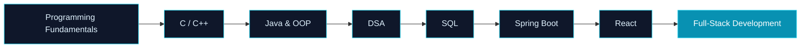

<div align="center">


<a href="https://github.com/mohammadkaif261001-netizen">
  
</a>

<br/>


<br/><br/>

<a href="https://www.linkedin.com/in/mohammad-kaif-hosen-topader-ab448a395/">
  
</a>
<a href="mailto:mohammadkaif261001@gmail.com">
  
</a>
<a href="https://kaif-hosen.netlify.app">
  
</a>
<a href="https://judge.beecrowd.com/en/profile/1207444">
  
</a>

</div>

<br/>

## 👨‍💻 About Me

I'm a Computer Science & Engineering student based in Bangladesh 🇧🇩, focused on building a strong foundation in programming fundamentals, Java & Object-Oriented Programming, and Data Structures & Algorithms — while actively developing practical, real-world web projects. I'm currently expanding into SQL, Spring Boot, and React, working toward a Software Engineering internship / Junior Software Engineer role.

```javascript
const developer = {
    name: "MD. Kaif Hosen Topader",
    role: "Computer Science & Engineering Student",
    location: "Bangladesh 🇧🇩",
    stack: ["Java", "C", "C++", "JavaScript", "HTML5", "CSS3"],
    learning: ["SQL", "Spring Boot", "React"],
    goal: "Software Engineering Internship / Junior Software Engineer"
};
```

<br/>

## ⭐ Featured Project

<div align="center">

</div>

<br/>

### 🧪 ELEMENTA — The Periodic Table

An interactive, responsive web-based Periodic Table designed to make exploring chemical elements simple, visual, and engaging.


<br/><br/>

<a href="ADD LIVE DEMO URL">
  
</a>
<a href="https://github.com/mohammadkaif261001-netizen/ELEMENTA----The-Periodic-Table">
  
</a>

> Live demo link pending — `[ADD LIVE DEMO URL]`

<br/>

| Feature | Description |
|---|---|
| 🧩 Interactive Periodic Table | Click and explore every element in a fully interactive layout |
| 🔍 Element Exploration | Browse elements by category, group, and period |
| 📋 Element Information | View detailed data for each chemical element |
| 📱 Responsive Design | Seamless experience across desktop, tablet, and mobile |
| 🎨 Modern UI | Clean, minimal, visually polished interface |
| ⚡ Lightweight Architecture | Built with vanilla HTML, CSS, and JavaScript — no bloated dependencies |

**Project Structure**

```text
ELEMENTA----The-Periodic-Table/
├── index.html
├── style.css
├── script.js
└── data.js
```

<br/>

## 💼 Other Projects

<table>
<tr>
<td width="50%">

### 🛡️ Smart Entry Security System
Java-based access control simulator featuring:
- OTP verification
- Face ID simulation
- Entry logging
- Time validation
- Fine calculation

</td>
<td width="50%">

### 🌐 Personal Portfolio Website
Responsive portfolio built with HTML, CSS, and JavaScript.

🔗 **Live:** [kaif-hosen.netlify.app](https://kaif-hosen.netlify.app)

</td>
</tr>
<tr>
<td width="50%">

### 📚 Java Practice Repository
Java learning repository covering:
- Core Java
- OOP
- Exception handling
- File handling

</td>
<td width="50%">

### 💻 HTML & CSS Projects
Responsive frontend projects using:
- HTML, CSS
- Flexbox
- Grid

</td>
</tr>
</table>

<br/>

## 🛠️ Tech Stack

**Languages**


**Frontend**


**Database**


**Backend / Currently Learning**


**Tools**


<br/>

## 🧭 Learning Roadmap


```mermaid
graph LR
    A[Programming Fundamentals] --> B[C / C++]
    B --> C[Java & OOP]
    C --> D[DSA]
    D --> E[SQL]
    E --> F[Spring Boot]
    F --> G[React]
    G --> H[Full-Stack Development]

    style A fill:#0f172a,stroke:#22d3ee,color:#e0f2fe
    style B fill:#0f172a,stroke:#22d3ee,color:#e0f2fe
    style C fill:#0f172a,stroke:#22d3ee,color:#e0f2fe
    style D fill:#0f172a,stroke:#22d3ee,color:#e0f2fe
    style E fill:#0f172a,stroke:#22d3ee,color:#e0f2fe
    style F fill:#0f172a,stroke:#22d3ee,color:#e0f2fe
    style G fill:#0f172a,stroke:#22d3ee,color:#e0f2fe
    style H fill:#0891b2,stroke:#22d3ee,color:#ffffff
```

<br/>

## 🐍 Contribution Snake

<div align="center">

</div>

This animation is generated automatically via GitHub Actions, visualizing my daily contribution graph as a snake eating through it.

<details>
<summary>⚙️ GitHub Actions Workflow (if not already set up)</summary>

Create `.github/workflows/snake.yml` in your **profile repository** (`mohammadkaif261001-netizen/mohammadkaif261001-netizen`):

```yaml
name: Generate Snake

on:
  schedule:
    - cron: "0 0 * * *"
  workflow_dispatch:
  push:
    branches:
      - main

jobs:
  generate:
    permissions:
      contents: write
    runs-on: ubuntu-latest
    steps:
      - uses: Platane/snk@v3
        with:
          github_user_name: ${{ github.repository_owner }}
          outputs: |
            dist/github-contribution-grid-snake-dark.svg?palette=github-dark
      - uses: crazy-max/ghaction-github-pages@v4
        with:
          target_branch: output
          build_dir: dist
        env:
          GITHUB_TOKEN: ${{ secrets.GITHUB_TOKEN }}
```

</details>

<br/>

## 📊 GitHub Analytics

<div align="center">


<br/>


<br/>


</div>

<br/>

## 🏆 GitHub Trophies

<div align="center">

</div>

<br/>

## 🎯 2026 Goals

<table>
<tr>
<td width="50%" valign="top">

**Skill Building**
- Strengthen programming fundamentals
- Master Java
- Complete DSA roadmap
- Learn SQL
- Learn Spring Boot
- Learn React

</td>
<td width="50%" valign="top">

**Career & Growth**
- Build real-world projects
- Solve 1,000+ programming problems
- Make an open-source contribution
- Secure a software engineering internship
- Publish technical learning content

</td>
</tr>
</table>

<br/>

## 📚 Currently Learning

<div align="center">

☕ **Java & OOP** &nbsp;·&nbsp; 🧠 **DSA** &nbsp;·&nbsp; 🗄️ **SQL** &nbsp;·&nbsp; 🌱 **Spring Boot** &nbsp;·&nbsp; ⚛️ **React** &nbsp;·&nbsp; 🌐 **Full-Stack Development**

</div>

<br/>

## 📬 Connect With Me

<div align="center">

<a href="https://github.com/mohammadkaif261001-netizen">
  
</a>
<a href="https://www.linkedin.com/in/mohammad-kaif-hosen-topader-ab448a395/">
  
</a>
<a href="mailto:mohammadkaif261001@gmail.com">
  
</a>
<a href="https://kaif-hosen.netlify.app">
  
</a>

</div>

<br/>


